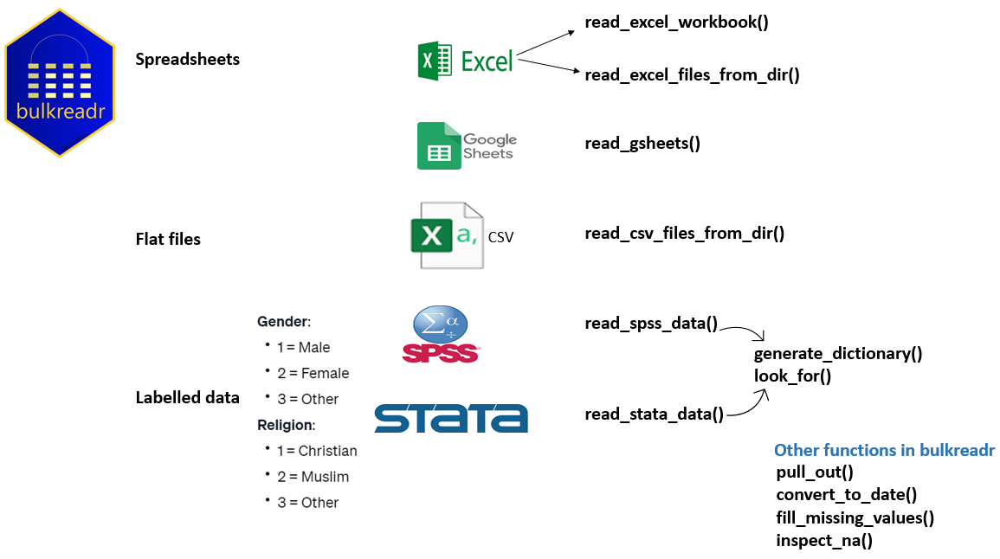

<!-- README.md is generated from README.Rmd. Please edit that file -->

```{r setup, include = FALSE}
knitr::opts_chunk$set(
  collapse = TRUE,
  message=FALSE, 
  warning=FALSE,
  comment = "#>",
  fig.path = "man/figures/README-",
  out.width = "100%")

options(tibble.print_min = 5, tibble.print_max = 5)
```

# bulkreadr <a></a>

> The Ultimate Tool for Reading Data in Bulk

<!-- badges: start -->
[](https://github.com/gbganalyst/bulkreadr/actions/workflows/R-CMD-check.yaml)
[](https://cran.r-project.org/package=bulkreadr)
[](https://cran.r-project.org/package=bulkreadr)
[](https://cran.r-project.org/package=bulkreadr)
[](https://app.codecov.io/gh/gbganalyst/bulkreadr?branch=main)
<!-- badges: end -->

## About the package

`bulkreadr` is an R package designed to simplify and streamline the process of reading and processing large volumes of data. With a collection of functions tailored for bulk data operations, the package allows users to efficiently read multiple sheets from Microsoft Excel/Google Sheets workbooks and multiple CSV files from a directory. It returns the data as organized data frames, making it convenient for further analysis and manipulation. 

Whether dealing with extensive data sets or batch processing tasks, "bulkreadr" empowers users to effortlessly handle data in bulk, saving time and effort in data preparation workflows.

Additionally, the package seamlessly works with labelled data from SPSS and Stata. For a quick video tutorial, I gave a talk at the International Association of Statistical Computing webinar. The recorded session is available [here](https://isi-web.org/webinar/iasc-bulkreadr-ultimate-tool-reading-data-bulk) and the webinar resources [here](https://github.com/gbganalyst/bulkreadr-webinar). 


## The Concept Map



## Installation

You can install `bulkreadr` package from [CRAN](https://cran.r-project.org/) with:

```{r eval=FALSE}
install.packages("bulkreadr")

```

or the development version from [GitHub](https://github.com/) with

``` r
if(!require("devtools")){
 install.packages("devtools")
}

devtools::install_github("gbganalyst/bulkreadr")
```

## How to load the package

Now that you have installed `bulkreadr` package, you can simply load it by using:

```{r pkgload}
library(bulkreadr)
```

## Context

bulkreadr is designed to integrate with and augment the capabilities of established packages such as `readxl`, `readr`, and `googlesheets4`, offering enhanced functionality for reading bulk data within the R programming environment.

  * [readxl](https://readxl.tidyverse.org) is the tidyverse package for reading Excel files (xls or xlsx) into an R data frame. 
  
  * [readr](https://readr.tidyverse.org) is the tidyverse package for reading delimited files (e.g., csv or tsv) into an R data frame. 
  
  * [googlesheets4](https://cran.r-project.org/package=googlesheets) is the package to interact with Google Sheets through the Sheets API v4  <https://developers.google.com/sheets/api>.
