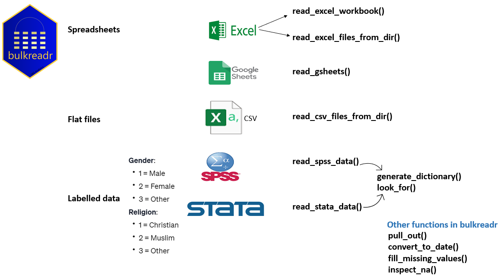

<!-- README.md is generated from README.Rmd. Please edit that file -->

# bulkreadr <a></a>

> The Ultimate Tool for Reading Data in Bulk

<!-- badges: start -->

[](https://github.com/gbganalyst/bulkreadr/actions/workflows/R-CMD-check.yaml)
[](https://cran.r-project.org/package=bulkreadr)
[](https://cran.r-project.org/package=bulkreadr)
[](https://cran.r-project.org/package=bulkreadr)
[](https://app.codecov.io/gh/gbganalyst/bulkreadr?branch=main)
<!-- badges: end -->

## About the package

`bulkreadr` is a robust and user-friendly R package designed to optimize the process of importing and processing large datasets. It offers streamlined functionality for reading multiple sheets from Microsoft Excel or Google Sheets workbooks, as well as handling multiple CSV files from a directory with ease. 

In addition, `bulkreadr` provides seamless compatibility with labelled data from software such as `SPSS` and `Stata`, automatically converting coded values into their respective labels upon import. This significantly reduces manual effort, making it an invaluable resource for data analysts and researchers looking to save time and optimize their workflows. 

For a quick video tutorial, I gave a talk at the International Association of Statistical Computing webinar. The recorded session is available [here](https://isi-web.org/webinar/iasc-bulkreadr-ultimate-tool-reading-data-bulk) and the webinar resources
[here](https://github.com/gbganalyst/bulkreadr-webinar).

## The Concept Map



## Installation

You can install `bulkreadr` package from
[CRAN](https://cran.r-project.org/) with:

``` r
install.packages("bulkreadr")
```

or the development version from [GitHub](https://github.com/) with

``` r
if(!require("devtools")){
 install.packages("devtools")
}

devtools::install_github("gbganalyst/bulkreadr")
```

## Usage

Now that you have installed `bulkreadr` package, you can simply load it
by using:

``` r
library(bulkreadr)
```

To get started with `bulkreadr`, read the
[docs](https://gbganalyst.github.io/bulkreadr/articles/index.html).

## Context

bulkreadr is designed to integrate with and augment the capabilities of
established packages such as `readxl`, `readr`, and `googlesheets4`,
offering enhanced functionality for reading bulk data within the R
programming environment.

- [readxl](https://readxl.tidyverse.org) is the tidyverse package for
  reading Excel files (xls or xlsx) into an R data frame.

- [readr](https://readr.tidyverse.org) is the tidyverse package for
  reading delimited files (e.g., csv or tsv) into an R data frame.

- [googlesheets4](https://cran.r-project.org/package=googlesheets) is
  the package to interact with Google Sheets through the Sheets API v4
  <https://developers.google.com/sheets/api>.
